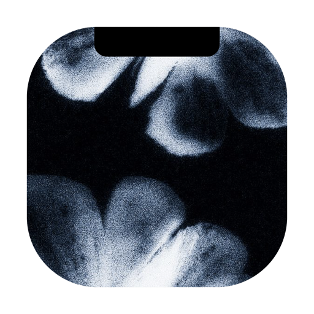

<div align="center">
  
  <h1>Limbo</h1>
  <p><strong>What you are moving, while you move it. A clipboard, a shelf and a converter that live in the notch of your Mac.</strong></p>
</div>

<p align="center">
  <a href="https://github.com/xmasyx/limbo/releases/latest"></a>
  
  
  <a href="LICENSE"></a>
</p>

## Install

```bash
brew install --cask xmasyx/tap/limbo
xattr -dr com.apple.quarantine /Applications/Limbo.app   # once: the app is not notarized
```

The second line is needed once. Limbo is signed with the project's own certificate but not
notarized by Apple, so without it macOS refuses to open the app (System Settings → Privacy &
Security → *Open Anyway* does the same thing). After that Limbo updates itself: **Settings →
Updates → Verifica aggiornamenti** runs `brew upgrade`, clears the flag on the new copy and
relaunches.

Downloading the `.dmg` from the [releases page](https://github.com/xmasyx/limbo/releases/latest)
works too, and needs the same `xattr` line on the copy you drag into `/Applications`.

**What it needs:** macOS 14 or newer on an Apple Silicon Mac. The release binary is arm64 only.
A Mac without a notch works: the panel hangs from the top edge of the screen instead.

## What it does

Limbo has no Dock icon and no menu bar item. Everything happens where the notch is: move the
pointer there, or drag something onto it, and a panel opens with four tabs.

- **Appunti** — the last things you copied, text and images, ready to copy back or drag out.
  Text found inside an image is read on the Mac, so you can copy it from a screenshot.
- **Deposito** — the shelf. Drop a file on the notch and it is *moved* here, out of the way of
  whatever you are doing; drag it out when you need it. Screenshots can land here on their own,
  and entries expire into the Trash after a number of days you choose.
- **Converti** — images, video and documents converted with what macOS already ships: no ffmpeg,
  no upload. The original stays where it is; the result goes to the shelf.
- **Agents** — the coding-agent sessions open in your terminal, one row each, with the ones that
  are waiting for you marked. Clicking a row brings that session to the front. Reads a folder of
  small JSON files written by the sessions themselves.

## Privacy

Limbo makes exactly one network request, and only when you ask for it: the update check reads
the latest release from `api.github.com`. Nothing else leaves the Mac. What you copy stays in
`~/Library/Application Support/Limbo/`, in a plain readable index next to the files, and the app
has no telemetry and no analytics.

## Build it yourself

```bash
git clone https://github.com/xmasyx/limbo.git
cd limbo
./Scripts/build-app.sh          # builds, runs the benches, signs and installs into /Applications
```

The script builds a release binary, runs the self-test benches it carries (`--selftest-*`),
assembles the bundle, signs it with a local certificate if one exists, and installs it. Set
`LIMBO_SKIP_INSTALL=1` to build without installing. `Scripts/make-signing-cert.sh` creates the
self-signed identity used by the release workflow.

No dependencies: the clipboard is `NSPasteboard`, the shelf is the filesystem, sharing is
`NSSharingService`, conversion is ImageIO, AVFoundation and PDFKit. Everything is already in the
system.

## The interface speaks Italian

Every string the app shows is Italian, and a gate in the build refuses English words that crept
in. Translating it is a matter of one file, `Sources/Limbo/Strings.swift`.

## License

MIT — see [LICENSE](LICENSE).
